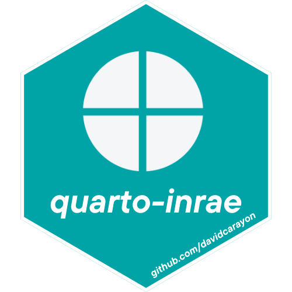

# Quarto templates for INRAE 

[](https://github.com/davidcarayon/quarto-inrae-extension/releases/latest)
[](commits/master)

The goal of this quarto extension is to provide a wide range of quarto-based formats for INRAE engineers and researchers. These are an __unofficial__ and __opiniated__ templates.

Related work :

- The [{InraeThemes}](https://github.com/davidcarayon/InraeThemes) R package for ggplot2 and bootstrap themes

## Prerequisites

To make the full use of these templates, you will need :

* 2 fonts defined in INRAE's design system : `Raleway` and `Avenir Next Pro Cn` that can be downloaded [here](https://charte-identitaire.intranet.inrae.fr/content/download/3007/30036?version=5)
* A LaTeX installation if you are using the `beamer` format 
* Of course, [Quarto](https://quarto.org/) installed (**> 1.4.0**)

## Installing in a new project

You will need to do this to get all the folders with all the templates, assets and prefilled quarto templates :

```bash
quarto use template davidcarayon/quarto-inrae-extension
```

## Installing for an existing project

You may also use this format with an existing project to download only the `_extensions` folder (**not recommended**).

```bash
quarto add davidcarayon/quarto-inrae-extension
```

## How to use it

The default template (`template.qmd` which is renamed to `your_directory_name.qmd`), is a revealjs presentation (html) output.

You also can use the other `template_*.qmd` templates which all have an `inrae-*` format pre-configured.

You will also find a `_quarto.yml` file to use if you want to use custom projects (manuscripts, websites, books).

These formats and designs are opiniated. Feel free to modify them to suit your needs in `_extensions/davidcarayon/inrae`. All suggestions and PR's are warmly welcomed.

To customise your formats, see the relevant documentations :

* Html and office documents (html/revealjs/docx/pptx) : [Quarto's documentation](https://quarto.org/docs/guide/)
* Typst documents (pdf) : [Typst's documentation](https://typst.app/docs/)
* LaTeX documents (beamer) : [LaTeX's Beamer documentation](https://www.overleaf.com/learn/latex/Learn_LaTeX_in_30_minutes)
* Quarto projects (manuscript, website, book) : [Quarto's documentation](https://quarto.org/docs/projects/quarto-projects.html)

## Standalone documents

### Documents

- `inrae-html` : Provides an html document that can be hosted online (quarto-pub, github/lab pages, etc.). See [Publishing](https://quarto.org/docs/publishing/) in Quarto's documentation
- `inrae-typst` : Generates a PDF document using the [Typst](https://typst.app) engine, a new open-source markup-based typesetting system that is designed to be as powerful as LaTeX while being much easier to learn and use.
- `inrae-docx` : Generates a word document, typically to share for revisions

### Slides

- `inrae-revealjs` : Generates HTML slides that can be hosted online (quarto-pub, github/lab pages, etc.). See [Publishing](https://quarto.org/docs/publishing/) in Quarto's documentation
- `inrae-beamer` : Generates PDF beamer slides using LaTeX
- `inrae-pptx` : Generates a Powerpoint presentation, typically to... whatever.

> NB : Some obscure error may occur when rendering Beamer if you are using 2023's version of texlive. If so, I can only suggest to follow [this article](https://blog.cynkra.com/posts/2021-10-07-old-texlive/) to try and go back to 2022's version.


## Projects

If you wish to use one of the 3 project formats, you can edit the `_extensions/davidcarayon/inrae/_extension.yml` to comment/uncomment your desired output :

```yaml
  ## Project definition
  project:
    project:
      type: default
     #type: website
     #type: manuscript
     #type: book
    format: inrae-html
```

- `manuscript` : Quarto manuscript projects provide a framework for writing and publishing scholarly articles. See more [here](https://quarto.org/docs/manuscripts/)
- `website` : Quarto Websites are a convenient way to publish groups of documents. They can also be used as easy to deploy research project websites. See more [here](https://quarto.org/docs/websites/)
- `book` : Quarto Books are combinations of multiple documents (chapters) into a single manuscript while not breaking cross-references. They can be typically used for complex reports. See more [here](https://quarto.org/docs/books/)

## Gallery and examples

- RevealJS presentation of the SK8 project (FR) : [slides](https://davidcarayon.github.io/slides/talks/CITISES_SK8/) and [code](https://github.com/davidcarayon/slides/tree/main/talks/CITISES_SK8)